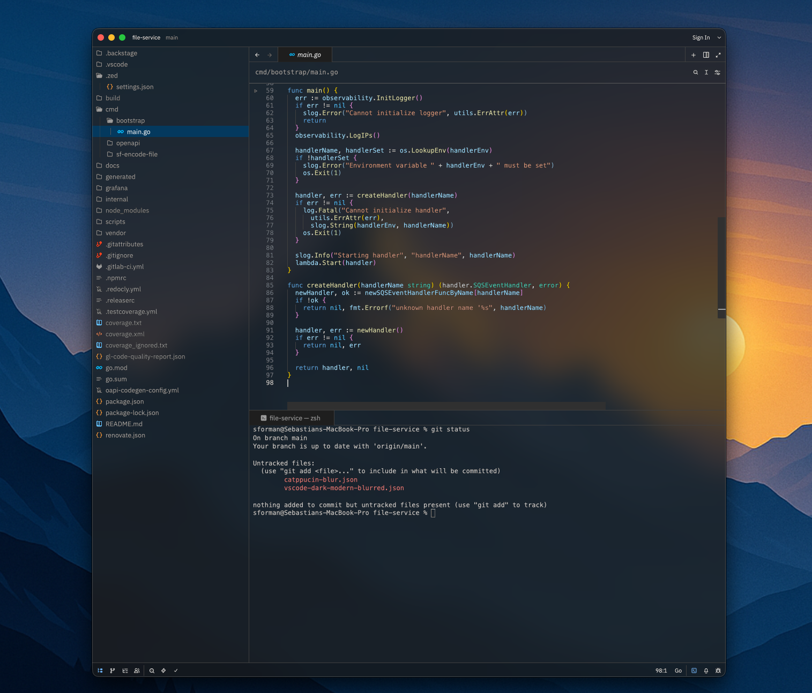

# VSCode Dark Modern Theme Blurred

Forked from: https://github.com/kevcamel/vscode_dark_modern.zed

One of the default themes from Microsoft's Visual Studio Code ported over to Zed.
- https://github.com/microsoft/vscode/blob/main/extensions/theme-defaults/themes/dark_modern.json

With transparency effects and background blurring applied

